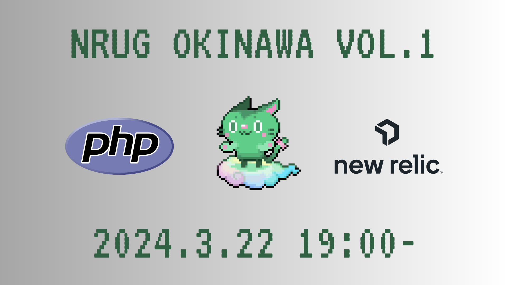
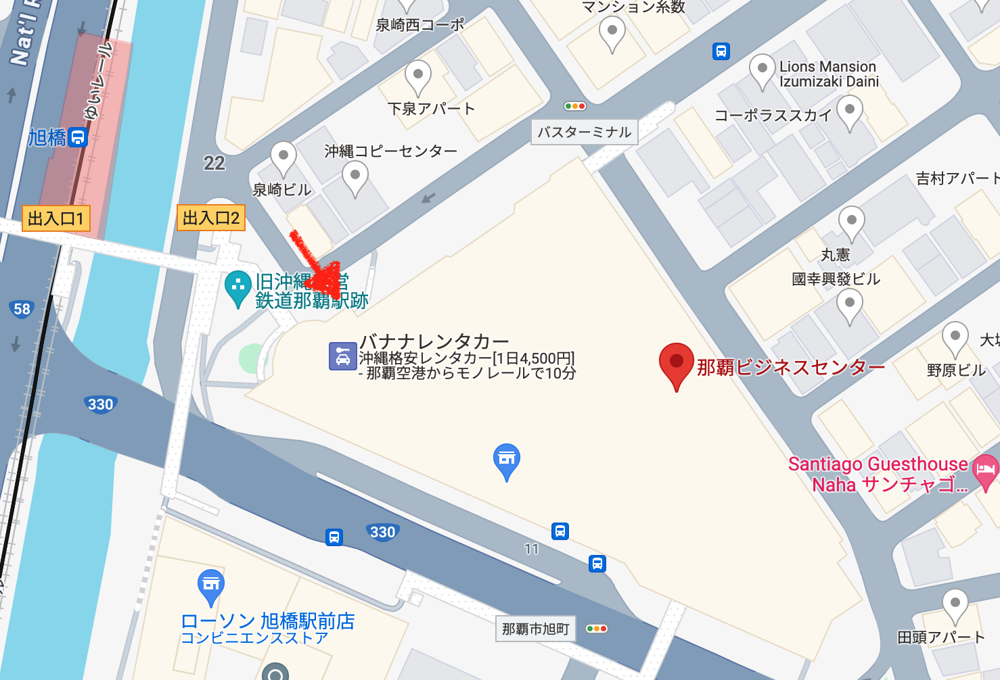
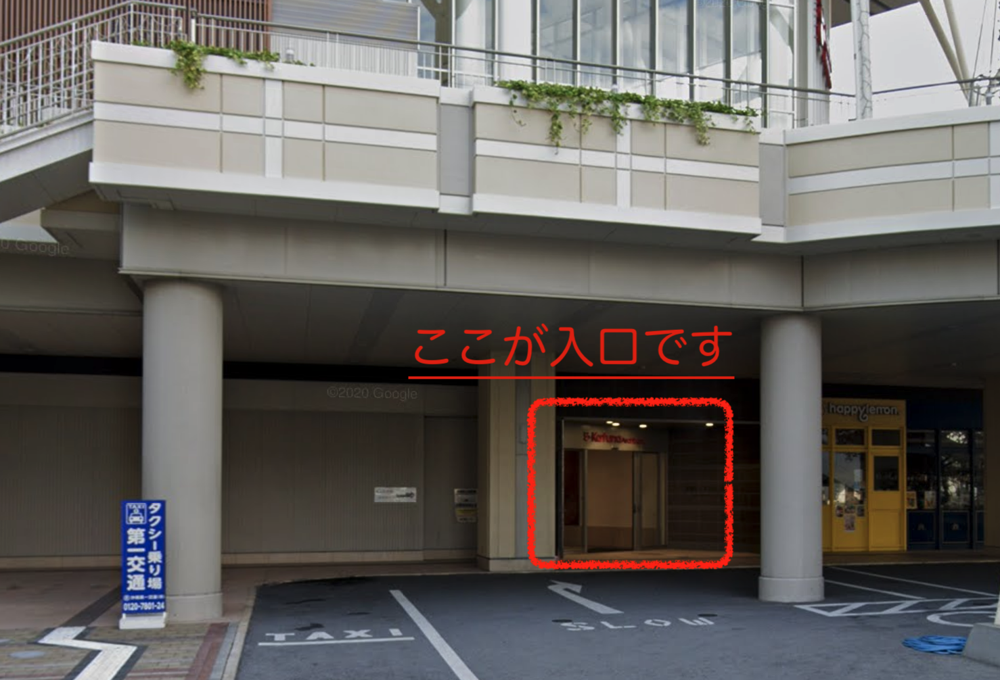

# NRUG沖縄支部 (New Relic User Group) Vol.1 ハンズオン！＠那覇

<a href="https://nrug-okinawa.connpass.com/event/311329/" target="_blank">connpassページ</a>

## 会場のご案内

* 株式会社SEEC（シーク） 沖縄県那覇市泉崎1-20-6 那覇ビジネスセンター7F
* <a href="https://maps.app.goo.gl/qY7m92fgatNSBpX17" target="_blank">Google Map</a>

入口が少し分かりづらいので下を参考にお越しください

## お願い

ハンズオンでSlackを使うため、事前にSlackのユーザー作成（会社ユーザーじゃなく個人ユーザーでOK）とNRUGのSlack参加をお願いします

* Slackのユーザーは下のURLから作成できます
    * <a href="https://slack.com/get-started#/create" target="_blank">Slackユーザー作成</a>

下のURLからジョインお願いします。

* <a href="https://join.slack.com/t/nrug/shared_invite/zt-y0de03za-0vCEQdEoGjKXoOrdrHlRzA" target="_blank">https://join.slack.com/t/nrug/shared_invite/zt-y0de03za-0vCEQdEoGjKXoOrdrHlRzA</a>
    * チャンネル `# okinawa` 

可能であれば事前に New Relic のフリーアカウント作成をお願いします。（当日も案内します）

* <a href="https://newrelic.com/jp/sign-up-japan" target="_blank">New Relic 無料サインアップ</a>
    * 会社メールアドレスじゃなく個人メールアドレスでOKです
